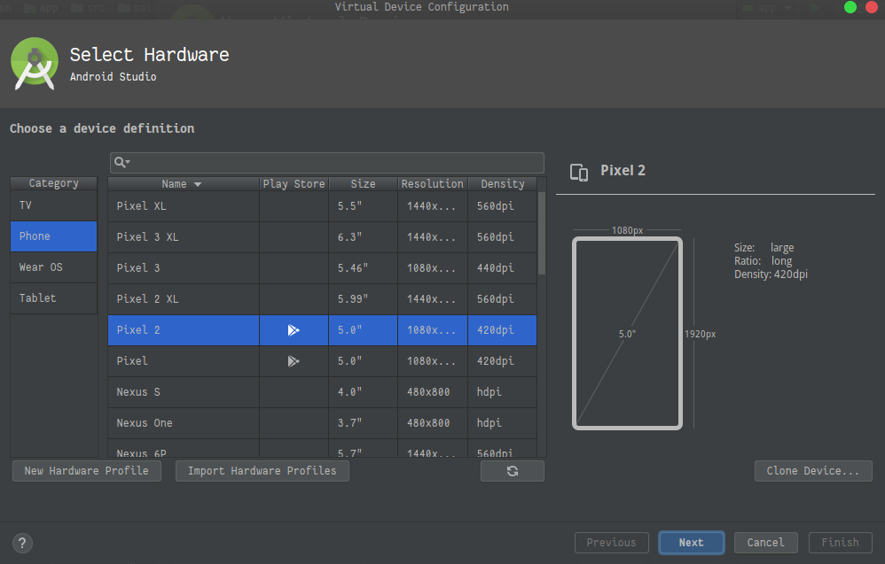

# Exodus:
Describtion.

## Requirements:
- modern browser (google chrome recommended)

- python3
    - For windows and Mac OSX you can download the installer it from [here](https://www.python.org/downloads/) for linux users you can download it from your package manager.
  
- mysql
   - For windows and Mac OSX you can download the installer it from [here](https://www.mysql.com/downloads/) for linux users you can download it from your package manager.

- Android studio
    - You can download it from [here](https://developer.android.com/studio/)

## Usage:

### Website:
 open exodus folder (the one with manage.py) open your **cmd** in windows or **teminal** in *unix systems and create virtual enviroment
 
 ```python
 python3 -m venv env
 ```
 activate it
 
 ```python
 source env/bin/activate 
 ```

and install the required python packages using requirement.txt
 
 ```python
 pip install -r requirements.txt
 ``` 

 - in windows if you have a problem with downloading mysqlclient package you will find the soluion in these youtube videos:
  
    - [mysql is not recognized as an internal or external command,operable program or batch file](https://youtu.be/ZO9g5JTyvQY)
    - [Fix pip install mysqlclient Error |Install Python mysqlclient in Windows 10](https://youtu.be/6SnE0r7g2lE )

change the database username and password in settings.py file in exodus folder

```python
DATABASES = {
    'default': {
        'ENGINE': 'django.db.backends.mysql',
        'NAME': 'Exodus',
        'USER': 'username',
        'PASSWORD': 'password',
        'HOST': '127.0.0.1',
        'PORT': '3306',
    }
}
```

run database.sql to make database sample

- open sql prompt

    - ```bash
        mysql -u username -p
      ```
        change username with your username and then it will ask you for the password.

- run database.sql
  - ```sql
    source database.sql
    ```

make the migrations

```python
python manage.py makemigraions

python manage.py migrate
```

run the server

```python
python manage.py runserver
```

open localhost at port 8000 in your browser [localhost:8000](http://127.0.0.1:8000)

### Android

- Before running the android application you should run the django app so that you will be able to connect to our api

- open the project in android studio using open an existing project then sync the project.

  - create a virtual device if you don't have one
     

  - or connect a real one


- if you will use genymotion instead of android emulator change '10.0.2.2' to '10.2.2.3' in your allowed hosts in django so that your virtual machine will be able to connec to our api.

```python
ALLOWED_HOSTS = [
    '127.0.0.1',
    'localhost',
    '10.0.2.2',
]
```
 
then run the application.

- The application will need INTERNET permission to connect to our api.

## License:

All Rights belongs to Exodus Developers.